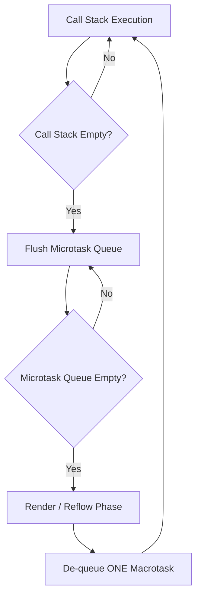
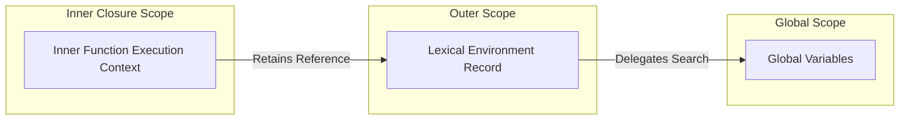
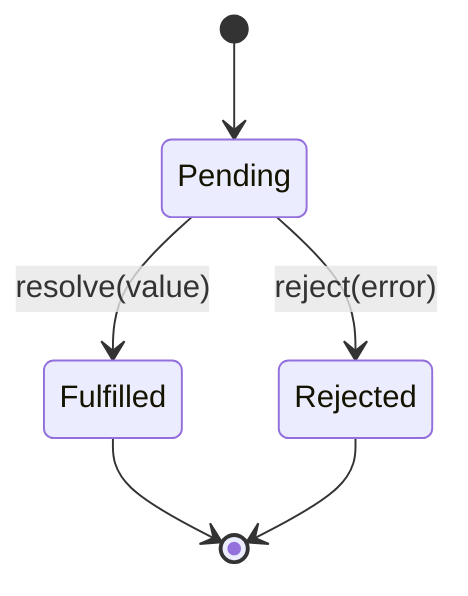
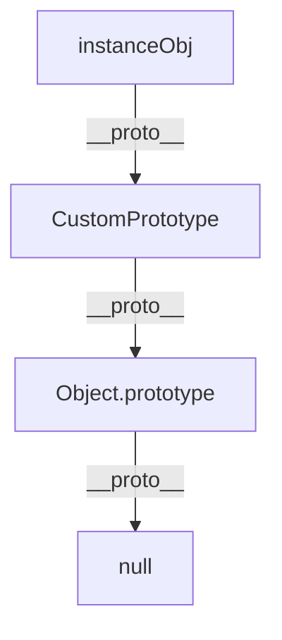
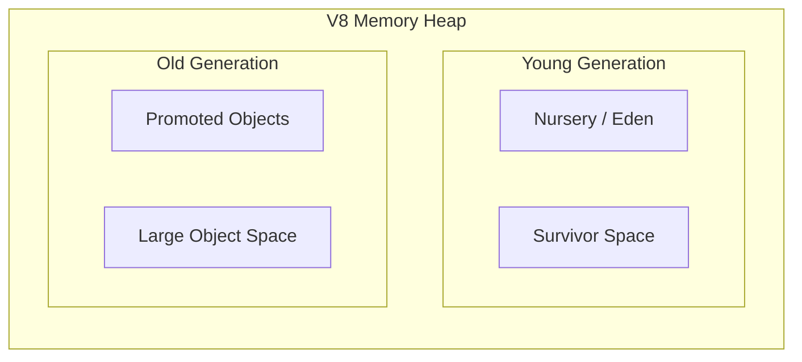
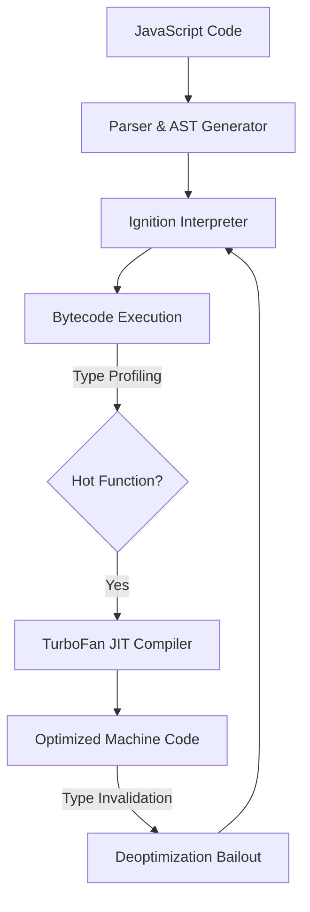
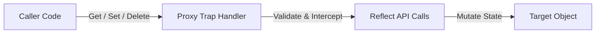
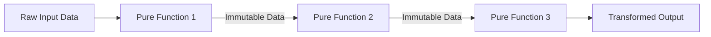

If you want to move from writing basic JavaScript to architecting high-performance applications, you need a crystal-clear mental model of what happens under the hood. 

In this comprehensive guide, we unpack **10 core concepts** of modern JavaScript—complete with execution mechanics, visual architecture diagrams, production code patterns, and V8 optimization secrets.


<!-- truncate -->

## 1. Understanding the Event Loop: Microtasks, Macrotasks, and Call Stack Visualized

If you ask ten JavaScript developers how the asynchronous execution model works, nine will tell you *"it handles async operations using callbacks."* That explanation misses the mechanical beauty of how JavaScript achieves non-blocking execution despite being **single-threaded**.

### The Call Stack vs. Event Loop Architecture

JavaScript operates on a **single call stack**. When you execute a function, it pushes a frame onto the stack. When the function returns, it pops off. 

To handle asynchronous operations without freezing the main UI thread, the browser runtime (V8, JavaScriptCore, SpiderMonkey) offloads work to **Web APIs** and coordinates execution using two queues:
1. **Microtask Queue** (High Priority)
2. **Macrotask Queue / Task Queue** (Standard Priority)



### Microtask vs. Macrotask Execution Order

The Event Loop follows a strict execution precedence:

1. Execute all synchronous code on the **Call Stack**.
2. Once the Call Stack is empty, process **ALL jobs in the Microtask Queue** until it is completely cleared.
3. Allow the engine to perform layout rendering and paint recalculation if needed.
4. Pick **ONE job from the Macrotask Queue** and push it onto the Call Stack.
5. Repeat.

| Queue Type | Operations |
| --- | --- |
| **Microtasks** | `Promise.then / catch / finally`, `queueMicrotask()`, `MutationObserver`, `process.nextTick` (Node.js) |
| **Macrotasks** | `setTimeout`, `setInterval`, `setImmediate`, `requestAnimationFrame`, I/O, UI Rendering |

### Event Loop Execution Walkthrough

Predict the exact output order of the following snippet:

```javascript
console.log('1: Sync Start');

setTimeout(() => {
  console.log('2: Macrotask (setTimeout)');
}, 0);

Promise.resolve().then(() => {
  console.log('3: Microtask 1');
}).then(() => {
  console.log('4: Microtask 2');
});

queueMicrotask(() => {
  console.log('5: Microtask 3');
});

console.log('6: Sync End');

```

**Output Breakdown:**

```text
1: Sync Start
6: Sync End
3: Microtask 1
4: Microtask 2
5: Microtask 3
2: Macrotask (setTimeout)

```

## 2. Mastering JavaScript Closures: Real-World Use Cases

A **closure** is created when a function is bundled together with references to its surrounding state (its **lexical environment**). Closures allow an inner function to retain access to an outer function's scope even after the parent function has finished executing.



### Production Patterns Using Closures

#### Pattern 1: Encapsulating Private Data

Before native `#private` class fields, closures provided private state encapsulation:

```javascript
function createSecureStore(initialBalance) {
  // Private variables inaccessible from external scopes
  let balance = initialBalance;
  const transactionHistory = [];

  function logTransaction(type, amount) {
    transactionHistory.push({
      type,
      amount,
      timestamp: new Date().toISOString(),
    });
  }

  return {
    deposit(amount) {
      if (amount <= 0) throw new Error('Invalid deposit amount');
      balance += amount;
      logTransaction('DEPOSIT', amount);
      return balance;
    },
    withdraw(amount) {
      if (amount > balance) throw new Error('Insufficient funds');
      balance -= amount;
      logTransaction('WITHDRAWAL', amount);
      return balance;
    },
    getHistory() {
      return [...transactionHistory]; // Immutable snapshot
    }
  };
}

const myAccount = createSecureStore(1000);
myAccount.deposit(500);
console.log(myAccount.balance); // undefined
console.log(myAccount.getHistory()); // 1 transaction record

```

#### Pattern 2: Memoization (Caching Expensive Computations)

```javascript
function memoize(fn) {
  const cache = new Map();

  return function (...args) {
    const key = JSON.stringify(args);
    if (cache.has(key)) {
      return cache.get(key);
    }
    
    const result = fn.apply(this, args);
    cache.set(key, result);
    return result;
  };
}

const factorial = memoize((n) => {
  if (n === 0 || n === 1) return 1;
  return n * factorial(n - 1);
});

console.time('First Run');
factorial(100); // Computed and saved in closure state
console.timeEnd('First Run');

console.time('Second Run');
factorial(100); // Instant lookup from closure cache
console.timeEnd('Second Run');

```

## 3. Promises, Async/Await, and Error Handling Best Practices

Promises represent values that will settle in the future. They transition through three explicit states:



### Sequential Waterfalls vs. Concurrent Parallel Execution

#### ❌ Anti-Pattern: Sequential Fetch Waterfall

```javascript
async function fetchDashboardSequential(userId) {
  const user = await fetchUser(userId);       // Takes 300ms
  const posts = await fetchPosts(userId);     // Takes 400ms
  const stats = await fetchAnalytics(userId); // Takes 200ms
  return { user, posts, stats };             // Total Time: ~900ms
}

```

#### ✅ Refactored Pattern: Parallel Fetching with `Promise.allSettled`

```javascript
async function fetchDashboardConcurrent(userId) {
  try {
    const [userResult, postsResult, statsResult] = await Promise.allSettled([
      fetchUser(userId),
      fetchPosts(userId),
      fetchAnalytics(userId),
    ]);

    return {
      user: userResult.status === 'fulfilled' ? userResult.value : null,
      posts: postsResult.status === 'fulfilled' ? postsResult.value : [],
      stats: statsResult.status === 'fulfilled' ? statsResult.value : null,
      errors: [userResult, postsResult, statsResult]
        .filter(res => res.status === 'rejected')
        .map(res => res.reason),
    };
  } catch (error) {
    console.error('Fatal pipeline error:', error);
    throw error;
  }
}

```

## 4. Prototypes, Inheritance, and the Prototype Chain

JavaScript uses **prototypal inheritance**. Objects inherit directly from other objects via an internal link called `[[Prototype]]` (accessible via `Object.getPrototypeOf()` or `__proto__`).



### Prototypal Constructor vs. ES6 Class Equivalent

```javascript
// Function Constructor & Prototype Chain
function BaseComponent(id) {
  this.id = id;
}

BaseComponent.prototype.render = function () {
  console.log(`Rendering ID: ${this.id}`);
};

function ButtonComponent(id, label) {
  BaseComponent.call(this, id);
  this.label = label;
}

ButtonComponent.prototype = Object.create(BaseComponent.prototype);
ButtonComponent.prototype.constructor = ButtonComponent;

ButtonComponent.prototype.click = function () {
  console.log(`Clicked ${this.label}`);
};

const btn = new ButtonComponent('btn-01', 'Submit');
btn.render(); // Derived via prototype lookup
btn.click();

```

---

## 5. Garbage Collection & Memory Leak Prevention in V8

V8 automates memory allocation and garbage collection using **Generational Garbage Collection** and **Mark-and-Sweep** algorithms.



### Common Memory Leaks and Solutions

#### Leak: Dangling Global Event Listeners

```javascript
// ❌ LEAK: Retains event listener and bound variables in memory
function attachListener() {
  const payload = new Array(1000000).fill('data');
  window.addEventListener('resize', () => {
    console.log(payload.length);
  });
}

// ✅ FIX: Clean teardowns using AbortController
const controller = new AbortController();

window.addEventListener(
  'resize',
  () => console.log('Resized cleanly'),
  { signal: controller.signal }
);

// Tear down listener when unmounting
controller.abort();

```

## 6. Modern Syntax Features: ES2024 to ES2026

### 1. `Object.groupBy()`

Groups iterable items using custom callback keys:

```javascript
const items = [
  { name: 'Laptop', category: 'tech', price: 1200 },
  { name: 'Chair', category: 'home', price: 250 },
  { name: 'Phone', category: 'tech', price: 800 },
];

const grouped = Object.groupBy(items, (item) => item.category);
console.log(grouped.tech);

```

### 2. Explicit Resource Management: `using` Declarations

Automatically manages cleanup via `Symbol.dispose`:

```javascript
class DatabaseConnection {
  constructor(uri) {
    console.log(`Connected to ${uri}`);
  }

  query(sql) {
    return `Executing: ${sql}`;
  }

  [Symbol.dispose]() {
    console.log('Closing database connection automatically...');
  }
}

function runTransaction() {
  // Automatically disposed when block exits
  using db = new DatabaseConnection('postgres://localhost:5432/main');
  console.log(db.query('SELECT * FROM users'));
}

runTransaction();

```

### 3. Change Array by Copy

Perform immutable transformations on arrays:

```javascript
const numbers = [3, 1, 4, 2];

const sorted = numbers.toSorted();
const reversed = numbers.toReversed();
const updated = numbers.with(2, 99);

console.log(numbers); // [3, 1, 4, 2] (Preserved)
console.log(updated); // [3, 1, 99, 2]

```

## 7. How V8 Executes Code: Ignition & TurboFan

V8 processes source code through a multi-tier compilation pipeline:



### V8 Optimization Tip: Keep Function Calls Monomorphic

```javascript
function calculateTotal(item) {
  return item.price * 1.18;
}

// ✅ FAST: Monomorphic Calls (Identical Object Shape)
calculateTotal({ price: 100, name: 'Item A' });
calculateTotal({ price: 200, name: 'Item B' });

// ❌ SLOW: Polymorphic/Megamorphic Calls (Causes JIT Deoptimization)
calculateTotal({ price: 100 });
calculateTotal({ cost: 200, price: 50 });

```

## 8. Meta-Programming with Proxies and Reflect API

The `Proxy` object wraps a target object, enabling custom interception traps for operations like property reads, assignments, and deletions.



### Reactive State Engine Example

```javascript
function createReactiveSignal(target, onChange) {
  return new Proxy(target, {
    get(obj, prop, receiver) {
      const value = Reflect.get(obj, prop, receiver);
      if (typeof value === 'object' && value !== null) {
        return createReactiveSignal(value, onChange);
      }
      return value;
    },

    set(obj, prop, value, receiver) {
      const oldValue = obj[prop];
      if (oldValue !== value) {
        const success = Reflect.set(obj, prop, value, receiver);
        onChange(prop, value);
        return success;
      }
      return true;
    }
  });
}

const state = createReactiveSignal(
  { count: 0, user: { name: 'Ajay' } },
  (key, value) => console.log(`[UI Auto-Render]: Key "${String(key)}" updated to ${value}`)
);

state.count++; 
// [UI Auto-Render]: Key "count" updated to 1

state.user.name = 'Ajay Dhangar';
// [UI Auto-Render]: Key "name" updated to Ajay Dhangar

```

## 9. Functional Programming Principles in JavaScript

Functional Programming relies on **pure functions**, **immutability**, and **function composition**.



### Composable Pipeline Pattern

```javascript
const trim = (str) => str.trim();
const toLowerCase = (str) => str.toLowerCase();
const replaceSpaces = (str) => str.replace(/\s+/g, '-');
const addPrefix = (prefix) => (str) => `${prefix}-${str}`;

// Functional Pipe Operator Implementation
const pipe = (...fns) => (initialValue) =>
  fns.reduce((acc, currentFn) => currentFn(acc), initialValue);

const generateSlug = pipe(
  trim,
  toLowerCase,
  replaceSpaces,
  addPrefix('article')
);

console.log(generateSlug('  Mastering Modern JavaScript 2026!  '));
// Output: "article-mastering-modern-javascript-2026!"

```

---

## 10. Multi-Threading with Web Workers & Transferable Objects

Because JavaScript runs on a single thread, cpu-intensive tasks can block the UI thread. **Web Workers** run scripts on background background OS threads.

### Implementation

```javascript
// main.js - Main Thread
const worker = new Worker('worker.js');

// Allocate 64MB ArrayBuffer
const allocationSize = 8 * 1024 * 1024;
const memoryBuffer = new ArrayBuffer(allocationSize * 8);

// Transfer ownership to worker without memory copy overhead
worker.postMessage({ dataBuffer: memoryBuffer }, [memoryBuffer]);

console.log('Main memory size after transfer:', memoryBuffer.byteLength); // 0 (Detached)

worker.onmessage = (event) => {
  console.log('Worker task complete!', event.data);
  worker.terminate();
};
```

## Summary Checklist for JS Developers

* [x] **Event Loop:** Clear microtasks before yielding to macrotasks or UI renders.
* [x] **Memory Management:** Clean up event listeners using `AbortController` signals.
* [x] **V8 Performance:** Write monomorphic calls to maintain V8 Inline Caches.
* [x] **Modern Features:** Use explicit resource management (`using`) and non-mutating array operations (`toSorted`, `with`).

*Enjoyed this article? Share it or follow me on [GitHub](https://github.com/ajay-dhangar) and [LinkedIn](https://www.linkedin.com/in/ajay-dhangar/).*